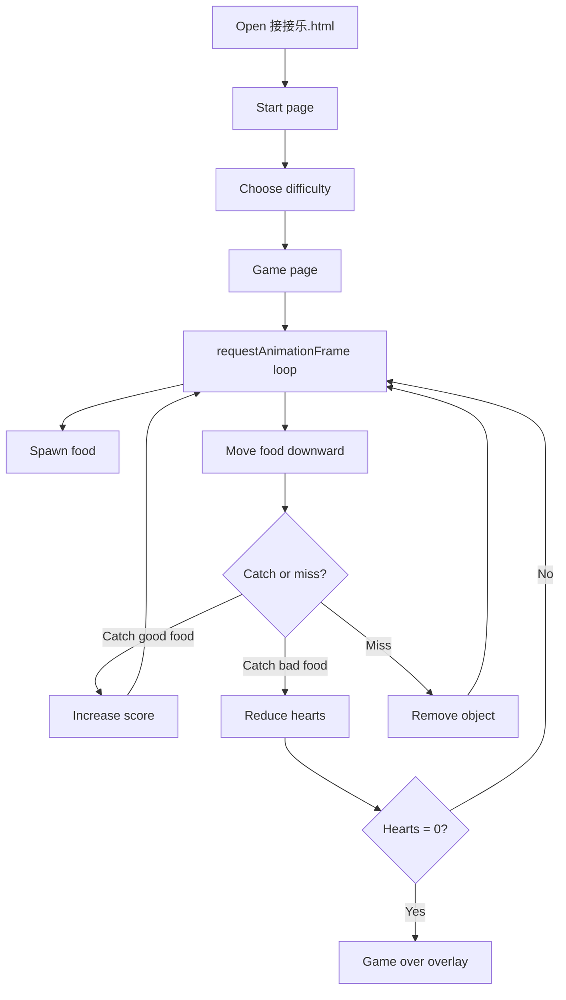
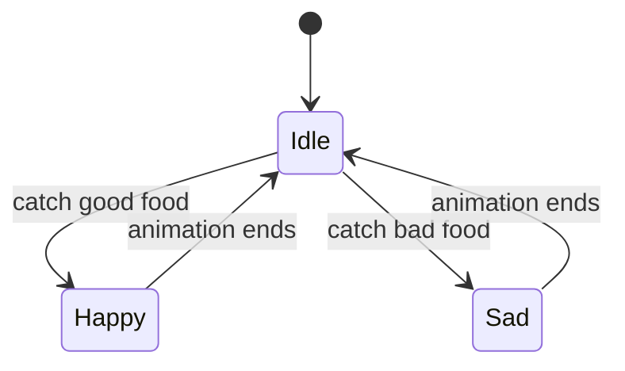
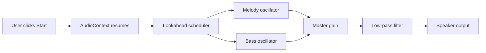

# 接接乐 Code Explanation / 接接乐 代码讲解

This guide is bilingual. Each section shows Chinese and English side by side so students can compare the same idea in both languages.

| 中文 | English |
| --- | --- |
| 这是一份双语教学材料。每一节都把中文和英文并排展示，方便学生对照学习。 | This is a bilingual teaching guide. Each section places Chinese and English side by side so students can compare the same idea in both languages. |

## 1. What this project is / 这个项目是什么

| 中文 | English |
| --- | --- |
| `接接乐.html` 是一个单文件浏览器游戏。HTML 负责结构，CSS 负责样式，JavaScript 负责状态、动画、存储和音频。 | `接接乐.html` is a single-file browser game. HTML handles structure, CSS handles style, and JavaScript handles state, animation, storage, and audio. |
| 浏览器先读 HTML，再应用 CSS，最后执行 JavaScript。JavaScript 不是替代浏览器，而是控制浏览器要显示什么。 | The browser reads HTML first, then applies CSS, and finally runs JavaScript. JavaScript does not replace the browser; it tells the browser what to display. |

## 2. The big picture / 整体结构

| 中文 | English |
| --- | --- |
| 游戏有三个页面：开始页、难度页、游戏页。点击按钮时，代码会隐藏一个页面并显示另一个页面。 | The game has three pages: start, setup, and game. When the player clicks buttons, the code hides one page and shows another. |
| 核心流程是：进入游戏、生成食物、检测碰撞、更新分数、结束回合。 | The core flow is: enter the game, spawn food, detect collisions, update score, and end the round. |

## 3. HTML and JavaScript roles / HTML 和 JavaScript 的分工

| 中文 | English |
| --- | --- |
| HTML 像舞台搭建图，负责把按钮、分数、角色和页面区域放出来。JavaScript 像导演和控制台，负责决定什么时候切页、什么时候生成食物、什么时候播放音乐、什么时候结束游戏。 | HTML is like the stage plan: it places the buttons, score, character, and page areas. JavaScript is like the director and control panel: it decides when to switch pages, when to spawn food, when to play music, and when the round ends. |
| 初学者可以这样记：HTML 管“有什么”，JavaScript 管“什么时候发生”和“发生什么变化”。 | A beginner can remember it this way: HTML handles "what exists," while JavaScript handles "when something happens" and "what changes." |

### Flowchart / 流程图



## 4. Important variables / 重要变量

| 中文 | English |
| --- | --- |
| `pages` 保存三个页面的 DOM 引用。`foods` 保存所有正在下落的物体。`hearts`、`goodCount` 和 `badCount` 保存当前回合状态。 | `pages` stores the DOM references for the three pages. `foods` stores all active falling objects. `hearts`, `goodCount`, and `badCount` store the current round state. |
| 好的做法是把“固定值”放进常量，把“会变化的值”放进状态变量。 | A good pattern is to keep fixed values in constants and changing values in state variables. |

## 5. How the pages work / 页面切换

| 中文 | English |
| --- | --- |
| `showPage(name)` 会先隐藏所有页面，再显示指定页面。 | `showPage(name)` hides all pages first, then shows the selected one. |
| 这是最常见的前端切屏方法：通过 class 切换控制显示与隐藏。 | This is a common frontend page-switching pattern: use class changes to control visibility. |

## 6. The game loop / 游戏循环

| 中文 | English |
| --- | --- |
| 游戏每一帧都会做同样的事情：测时间、移动食物、检查碰撞、更新界面，然后请求下一帧。 | Every frame, the game does the same steps: measure time, move food, check collisions, update the UI, then request the next frame. |
| `requestAnimationFrame` 比普通定时器更适合动画，因为它和屏幕刷新同步。 | `requestAnimationFrame` is better for animation than a normal timer because it stays in sync with the screen refresh rate. |

```js
function gameLoop(timestamp){
  if(!gameActive) return;
  if(!lastTimestamp) lastTimestamp = timestamp;
  const dt = Math.min(50, timestamp - lastTimestamp);
  lastTimestamp = timestamp;

  const cfg = DIFF_CONFIG[currentDifficulty];
  spawnAccumulator += dt;
  const jitteredInterval = cfg.spawnInterval * (0.75 + Math.random() * 0.5);
  if(spawnAccumulator > jitteredInterval){
    spawnAccumulator = 0;
    music.pulse(spawnFood());
  }

  updateFoods(dt);
  rafId = requestAnimationFrame(gameLoop);
}
```

## 7. Spawning food / 生成食物

| 中文 | English |
| --- | --- |
| `spawnFood()` 会随机决定是好食物还是坏食物，然后创建一个 DOM 节点加入舞台。 | `spawnFood()` randomly chooses a good or bad food, then creates a DOM node and adds it to the stage. |
| `Math.random()` 让每一局都不一样。`appendChild()` 让浏览器真正把元素放到页面里。 | `Math.random()` makes each round different. `appendChild()` tells the browser to place the element on the page. |

```js
function spawnFood(){
  const cfg = DIFF_CONFIG[currentDifficulty];
  const isBad = Math.random() < cfg.badProb;
  const emoji = isBad
    ? BAD_FOODS[Math.floor(Math.random()*BAD_FOODS.length)]
    : GOOD_FOODS[Math.floor(Math.random()*GOOD_FOODS.length)];
  const speed = cfg.minSpeed + Math.random() * (cfg.maxSpeed - cfg.minSpeed);
  const x = 24 + Math.random() * (stageRect.width - 48);

  const el = document.createElement('div');
  el.className = 'food';
  el.textContent = emoji;
  stageEl.appendChild(el);

  foods.push({
    id: ++foodIdSeq,
    x, y: -40,
    speed,
    type: isBad ? 'bad' : 'good',
    el
  });
  return isBad;
}
```

## 8. Catching and collision / 接取与碰撞

| 中文 | English |
| --- | --- |
| 每个物体都有 `x` 和 `y`。下落时只更新 `y`。当它进入接取区域时，代码会比较它和玩家的水平距离。 | Each object has `x` and `y`. During falling, only `y` changes. When it enters the catch zone, the code compares its horizontal distance to the player. |
| 这里不需要复杂物理引擎。因为玩家只左右移动，食物只上下移动，所以简单距离检测就够了。 | No complex physics engine is needed here. The player only moves left and right, and the food only moves down, so a simple distance check is enough. |

### State diagram / 状态图



## 9. Character states / 角色状态

| 中文 | English |
| --- | --- |
| 角色有三种状态：空闲、开心、难过。`setCharState()` 会切换对应的表情和 CSS 类。 | The character has three states: idle, happy, and sad. `setCharState()` switches the emoji and CSS class. |
| 这种写法适合“一个对象有多个模式”的场景。 | This pattern is useful when one object can exist in several modes. |

```js
function setCharState(n){
  charEl.classList.remove('state-1','state-2','state-3','pop-good','pop-bad');
  charEl.classList.add('state-' + n);
  charEmojiEl.textContent = n === 1 ? '😊' : (n === 2 ? '😆' : '😖');
}
```

## 10. Music system / 音乐系统

| 中文 | English |
| --- | --- |
| 音乐使用 Web Audio API 在浏览器里实时生成，不依赖音频文件。 | The music uses the Web Audio API to generate sound in the browser, so no audio file is required. |
| 控制器有两个主要功能：音量控制和节奏同步。 | The controller has two main jobs: volume control and rhythm sync. |
| `musicEnabled` 是开关；`musicVolume` 是 0 到 1 的音量值。 | `musicEnabled` is the on/off switch; `musicVolume` is the gain value from 0 to 1. |

### Audio architecture / 音频结构



### Rhythm sync / 节奏同步

| 中文 | English |
| --- | --- |
| 音乐速度和食物生成间隔绑定：`tempo = 60000 / spawnInterval`。这样食物越快，音乐也越快。 | Music speed is tied to the food spawn interval: `tempo = 60000 / spawnInterval`. Faster food means faster music. |
| 高速模式会切换到另一套更像 8-bit 游戏的模式，而不是把同一段旋律简单加速。 | High-speed mode switches to a separate 8-bit-like pattern instead of simply speeding up the same melody. |

### Example control code / 控制代码示例

```js
function setMasterVolume(value){
  musicVolume = Math.max(0, Math.min(1, value));
  if(master){
    master.gain.value = musicEnabled ? musicVolume : 0;
  }
}

function updateTempoFromSpawnInterval(spawnInterval){
  tempo = Math.max(72, Math.min(132, 60000 / spawnInterval));
}
```

## 11. Practice and quiz / 练习与测验

| 中文 | English |
| --- | --- |
| 练习页提供分步走读和小测验。中文和英文都可以单独点击，帮助学生对照理解。 | The practice page provides a step-by-step walkthrough and a quiz. Chinese and English can be explored separately to help students compare both languages. |
| 练习建议：找到 `startGame()`、`spawnFood()`、`updateFoods()` 和 `createMusicController()`，分别说出它们负责什么。 | Practice suggestion: find `startGame()`, `spawnFood()`, `updateFoods()`, and `createMusicController()`, then explain what each one is responsible for. |

## 12. WSL emoji note / WSL 表情说明

| 中文 | English |
| --- | --- |
| 在 WSL 里，本地 emoji 字体可能不完整，所以页面使用 Twemoji 来避免乱码或空白方块。 | In WSL, local emoji fonts may be incomplete, so the page uses Twemoji to avoid missing glyphs or empty boxes. |
| 这是一个很实用的工程技巧：如果视觉很重要，就不要只依赖用户机器上的字体。 | This is a practical engineering lesson: if the visual matters, do not rely only on the fonts installed on the user machine. |

## 13. Final idea / 最后一句

| 中文 | English |
| --- | --- |
| 好代码不只是“能运行”，还要让人看得懂。变量、函数和注释都应该帮助读者理解程序是怎么工作的。 | Good code is not just code that works. Variables, functions, and comments should help the reader understand how the program works. |
